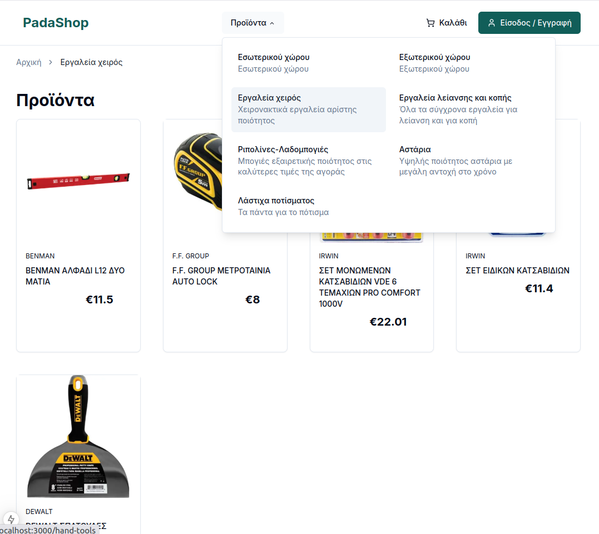
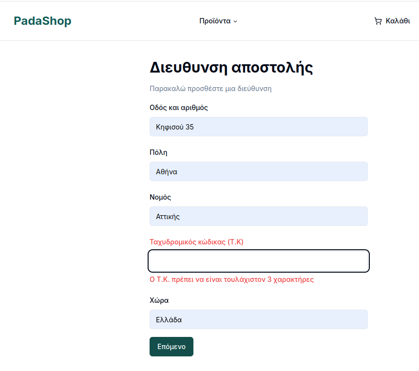
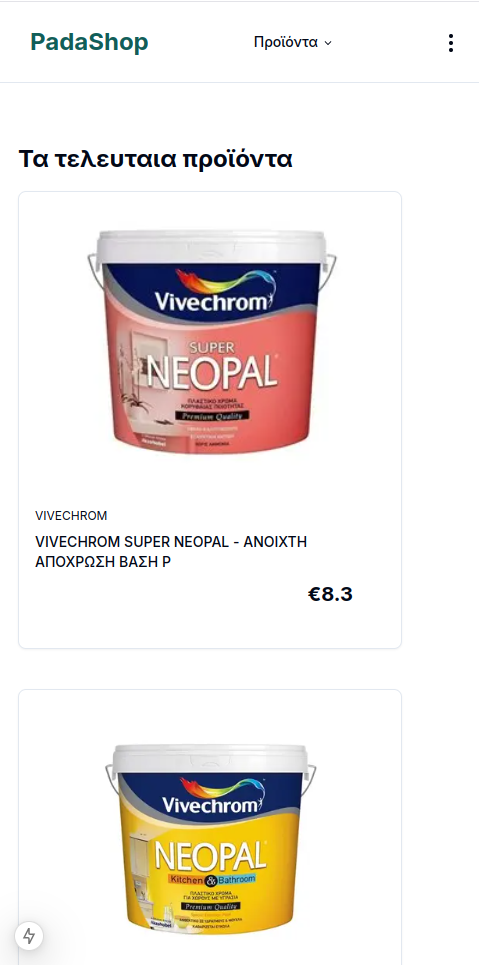

<!--
theme: default
_class: ttl
paginate: true
_paginate: false
size: 5/4
-->

# Μάθημα: Ανάπτυξη εφαρμογών στο Διαδίκτυο
## Εργασία «Ηλεκτρονικό Κατάστημα»

 

**Διδάσκοντες:**
Καθ. Νικήτας Ν. Καρανικόλας
Επ. Καθ. Χρήστος Τρούσσας
 

**Φοιτητής**: Παντελιάς Γεώργιος (mscict23047)
**Έτος**: 2025

---
## Περιγραφή
 

Η παρούσα εφαρμογή είναι ένα ηλεκτρονικό κατάστημα για λογαριασμό ενός χρωματοπωλείου.

 

Η εφαρμογή προσφέρει:
- **Front-facing ιστοσελίδα** για τους πελάτες του καταστήματος
- **Back-office ιστοσελίδα** για τους υπαλλήλους του καταστήματος που θα κάνουν το data entry των προϊόντων 

Υλοποιήθηκε το **σύνολο** των προαπαιτούμενων της εργασίας, συν επιπλέον backoffice εφαρμογή.

---
## Αρχιτεκτονική συστήματος

Οι **πελάτες** έχουν πρόσβαση στο περιεχόμενο μέσω της ΝΕΧΤ Js εφαρμογής.
Ενώ οι **διαχειριστές** έχουν πρόσβαση στο διαχειριστικό που σερβίρεται απευθείας από το backend.

---
### Δεδομένα 

 

Τα δεδομένα του συστήματος διατηρούνται σε βάση δεδομένων SQL με την οποία επικοινωνεί μόνο το backend(Spring Boot App).
Επιλέχθηκε η MYSQL 8, καθώς είναι δωρεάν και battle tested σε παραγωγικά περιβάλλοντα εδώ και χρόνια.

Η MySQL τρέχει σε docker instance, και περιλαμβάνεται στον κώδικα.

---

### Entity relationship diagram

---
### Back-end

Η εφαρμογή διαθέτει backend το οποίο σερβίρει:
- **REST** endpoints που καταναλώνονται από την front-end εφαρμογή
- Server-side rendered σελίδες για τους διαχειριστές
  
Το backend είναι μια **Spring Boot** 3.4.3 εφαρμογή γραμμένη σε **Java 23** ως gradle project.
Χρησιμοποιεί **Java Template Engine(JTE)** για τις server side σελίδες του backoffice.
H επικοινωνία με τη βάση γίνεται με παραδοσιακά queries μέσω jdbcClient και όχι με ORM framework.

---

### Front-end

H front-end εφαρμογή είναι αυτή που βλέπουν οι απλοί/διαπιστευμένοι πελάτες για να αγοράσουν τα προϊόντα.

Έχει γραφτεί με React Js σε **Typescript** πάνω στο framework **Next JS** προσφέροντας πλούσια ανάδραση και δυναμικότητα που χρειάζεται μια σύγχρονη εφαρμογή.

Η χρήση του Next JS προσφέρει το routing μηχανισμό, καθώς και το server side rendering ώστε να μην χαθεί το **SEO** του καταστήματος. Κάτι στο οποίο χωλαίνουν τα κλασσικά Single Page Apps γραμμένα React.

---

### Επικοινωνία

 

Η επικοινωνία front-end με back-end γίνεται μέσω HTTP, ενώ τα payloads είναι σε μορφή JSON.

Όλες οι εικόνες του site σερβίρονται ως static assets από την back-end εφαρμογή κάτω από το URL =http://localhost:8080/images ενώ μπαίνουν με εύκολο τρόπο μέσα από την διαχειριστική εφαρμογή.

---
## Εφαρμογή διαχειριστών

Οι διαχειριστές επισκεπτόμενοι τη σελίδα: http://localhost:8080 αποκτούν πρόσβαση στη διαχειριστική σελίδα μέσα από την οποία ενημερώνουν το δυναμικό περιεχόμενο της front-end eshop εφαρμογής.

Προσφέρονται 3 σελίδες για εισαγωγή
- Προϊόντων
- Κατηγοριών
- Χρηστών

---

## Εισαγωγή νέων προϊόντων από τους διαχειριστές

 

Στη σελίδα:http://localhost:8080/product/ βρίσκεται η φόρμα εισαγωγής προϊόντων.
.

Τα δεδομένα εγγράφονται στη βάση ενώ οι εικόνες σώζονται σε τοπικό φάκελο.

---

## Εισαγωγή νέων κατηγοριών από τους διαχειριστές

 

Στη σελίδα:http://localhost:8080/category/ βρίσκεται η φόρμα εισαγωγής κατηγοριών.

Από εδώ δημιουργούνται οι κατηγορίες και μετά το front-end τις ανανεώνει πλήρως δυναμικά στο μενού του.

---
## To ηλεκτρονικό κατάστημα

H κύρια σελίδα του καταστήματος.
Διαθέτει:
- **Καλάθι**
- **Είσοδο/εγγραφή χρήστη**
- **Μενού προϊόντων**
- **Λίστα προϊόντων**

Όλα τα δεδομένα που εμφανίζονται αλλάζουν πλήρως δυναμικά από το backend.

---

## Σελίδα κατηγορίας 

 Αν κάνουμε κλικ σε μια κατηγορία από το μενού, οδηγούμαστε στη λίστα προϊόντων που ανήκουν σε αυτή την κατηγορία.

 Το breadcrump ενημερώνεται δυναμικά.

---

## Σελίδα προϊόντος

Κάθε προιόν έχει τη δική του σελίδα.
- Εικόνα
- Τίτλο
- Περιγραφή
- Τιμή
- Απόθεμα
- Κουμπί εισαγωγής στο καλάθι

Το breadcrump εδώ μας δείχνει δυναμικά σε ποια κατηγορία ανήκει το προϊόν και είνα clickable.

---

## Προσθήκη στο καλάθι

Η προσθήκη γίνεται μόνο μέσα από τη σελίδα κάθε προϊόντος.
Το σύστημα δεν αφήνει να προστεθεί ποσότητα που δεν υπάρχει στο απόθεμα.
Κατά την προσθήκη εμφανίζεται βοηθητικό toast.

---

## Αν προσθέσουμε στο καλάθι

Παραπάνω από αυτά που διαθέτει το κατάστημα εμφανίζεται μήνυμα λάθους

---

## Καλάθι
Από εδώ μπορούμε:
- Να αλλάξουμε την ποσότητα
- Να αφαιρέσουμε τελειως το προϊόν
- Να δούμε την τιμή τεμαχίου
- Να δούμε το μερικό συνολο ανά προϊόν
- Να δούμε το συνολικό κόστος της παραγγελίας

Κάθε ενέργεια στο καλάθι ενημερώνει και τη βάση την ίδια στιγμή.

---

## Εισαγωγή διεύθυνσης

Αν κάνουμε κλικ στο Επόμενο του καλαθιού το σύστημα μας ζητάει τη διεύθυνση αποστολής.

 

Η φόρμα κάνει έλεγχο σε αυτά που εισάγει ο χρήστης ενώ τον καθοδηγεί με βοηθητικά μηνύματα.

---

## Εισαγωγή κάρτας πληρωμής

Μετά τη διεύθυνση ο χρήστης πρέπει να βάλει τις πληροφορίες της κάρτας του.

Το κουμπί **υποβολή παραγγελίας** θα σώσει την παραγγελία στη βάση και θα καθαρίσει το καλάθι. 

---

## Επιβεβαιωτικό παραγγελίας

Μετά την υποβολή το σύστημα δείχνει στο χρήστη τις λεπτομέρειες της παραγγελίας του όσον αφορά
- τα προϊόντα (ποσότητα και κόστος)
- τη διεύθυνση αποστολής που δήλωσε
- τον κωδικό παραγγελίας

Εμφανίζεται και link που τον πηγαινει στην πίσω σελίδα.

---

### Responsiveness

Οι σελίδες του ηλεκτρονικού καταστήματος είναι πλήρως responsive ώστε να φαίνονται καλά,
τόσο σε μεγάλες όσο και σε μικρές οθόνες κινητών.

---

## Not found σελίδα

Κάθε φορά που ο χρήστης θα πάει σε σελίδα που δεν υπάρχει το σύστημα θα τον κατευθύνει στην 404 σελίδα.

Εκεί θα βρει το link για να γυρίσει πίσω στην αρχική σελίδα.

---

## Αυθεντικοποίηση

Δεν έχει υλοποιηθεί αυθεντικοποίηση χρήστη. Όλες οι ενέργειες γίνονται με προκαθορισμένο χρήστη.

Έχει υλοποιηθεί ωστόσο το εικαστικό της σύνδεσης/εγγραφής της φόρμας.

---
# Τέλος παρουσίασης
#### Ευχαριστώ ! 